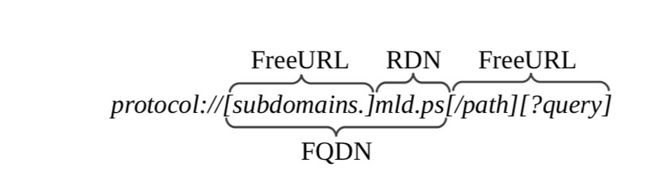

# url-feature-extractor

This url feature extractor extracts from a given URL potential features that might be able to indicate whether the given url is malicious or not.


## Usage

```git clone git@github.com:lifa08/url-feature-extractor.git```

```cd url-feature-extractor/```

```docker-compose up```

If you don't have docker engine or simply don't want to use docker, just use your own jupyter notebook to open the [url_feature_extractor.ipynb] file. In this case, you need to set up the environment yourself by installing the python libraries needed in thise project.

__Note: to use function ```is_malicious_in_google_safebrowsing``` and ```function is_malicious_in_virustotal```, google api key and virustotal api key are needed, so you need to get those for yourself and store it in the env.list file. To make the code runnable without those keys, these functions are commented out. So after you get keys for yourself, uncomment it these function calls.__

## Technologies and python libraries

- Dockerized Jupyter
- Pandas
- requests
- tldextract
- pysafebrowsing
- python-whois
- html2text
- lxml

## Features

This url structure image might help to understand what the following features mean.

 

- FQDN: Fully Qualified Domain Name
- mld: main level domain
- RDN: Registered Domain Name [Reference](https://arxiv.org/pdf/1510.06501.pdf)

The 36 extracted features are constructed by mainly refering to three academic papers: [Know your phish](https://arxiv.org/pdf/1510.06501.pdf), [DeltaPhish](https://arxiv.org/pdf/1707.00317.pdf) and [PhishAri](https://arxiv.org/pdf/1301.6899.pdf).

These features can be classified into two catogories and are shown as follows:

- **12 url features**

	* url_length
	* is_blacklisted
	* is_IPbased
	* domain_age
	* FreeURL_dot_cnt
	* level_domain_cnt: count of level domains
	* FQDN_length
	* mld_length
	* url_terms_cnt
	* RDNRank
	* domain_provider
	* domain_valid_period

- **Page visit features**

	* redirect_number
	* landing_url
	* title_term_cnt: count of terms in webpage title
	* text_term_cnt
	* iframe_number
	* input_number: number of input fields
	* image_number
	* href_number: number of href links in <a> tags
	* mld_equals: whether main level domain equeals in starting url and landing url
	* starting_mld_in_title: does starting main level domain appear in web page title
	* starting_mld_in_text
	* starting_mld_in_href_FreeURL
	* landing_mld_in_title
	* landing_mld_in_text
	* landing_mld_in_href_FreeURL
	* **Comparison features**(home page vs input page)
		* hyper_link_jaccard: jaccard similarity between the hyper links of homepage and thos of inputpage
		* hyper_link_mld_jaccard: jaccard similarity between mlds in the hyper links of homepage and thos of inputpage
		* ss_jaccard: jaccard similarity between the <style> tags of homepage and those of inputpage
		* ss_url_jaccard: jaccard similarity between urls of the external style sheets in homepage and those of inputpage
		* ss_url_mld_jaccard
		* img_url_jaccard
		* img_url_mld_jaccard
		* title_jaccard
		* is_hompage_linked: is homepage linked in the input page


## To do
* Use unit test framework to test the code more rigoulously
* Extract more features
* Figure out how to visit a malicous website in a safe way, so can parse the visit page features of malicious page(it might not be a problem though especially in docker)
* Find a dataset that contains a url and a lable that tells whether the given url is malicous or not
* Experiment different machine learning classification models and select a suitable one
* Train the selected model in AWS and deploy the corresponding endpoint there
* Develop a web application to provide url online checking service by using AWS lamda and API gateway

